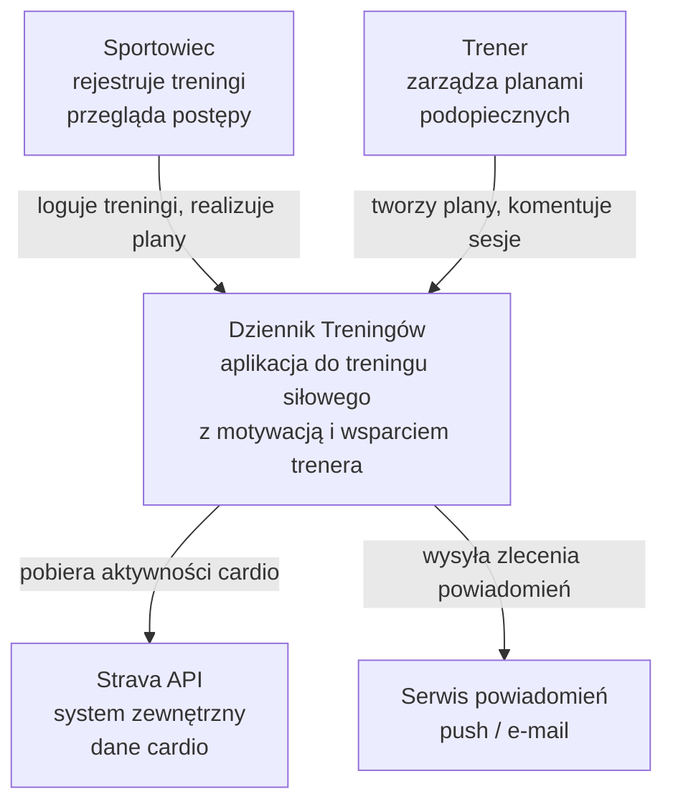
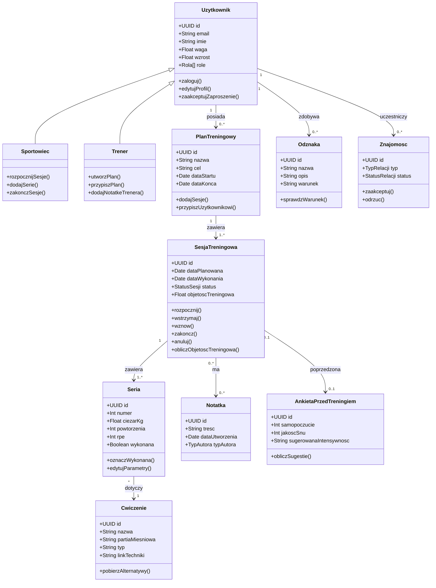
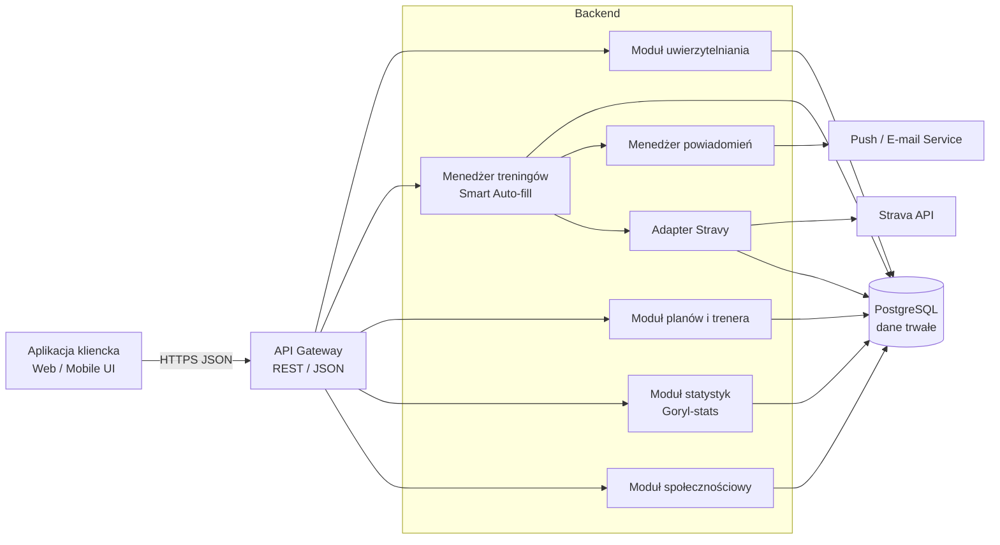
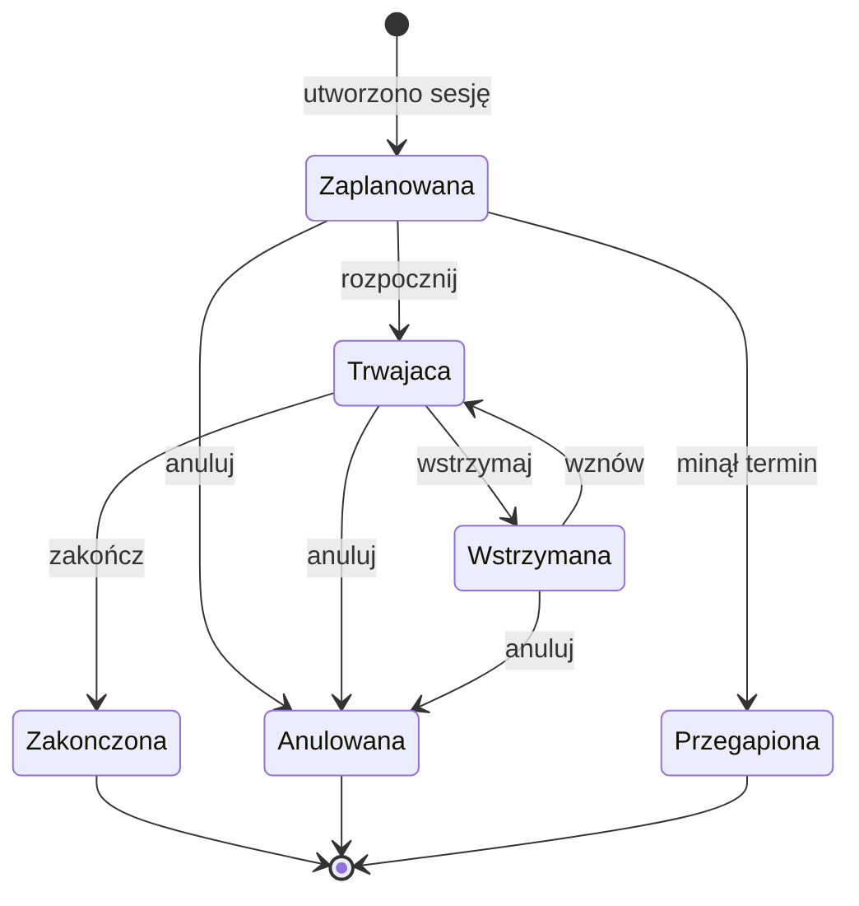
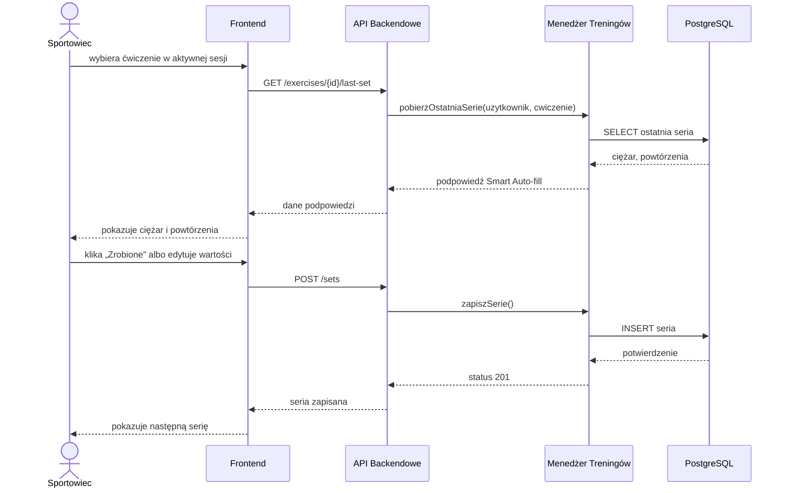
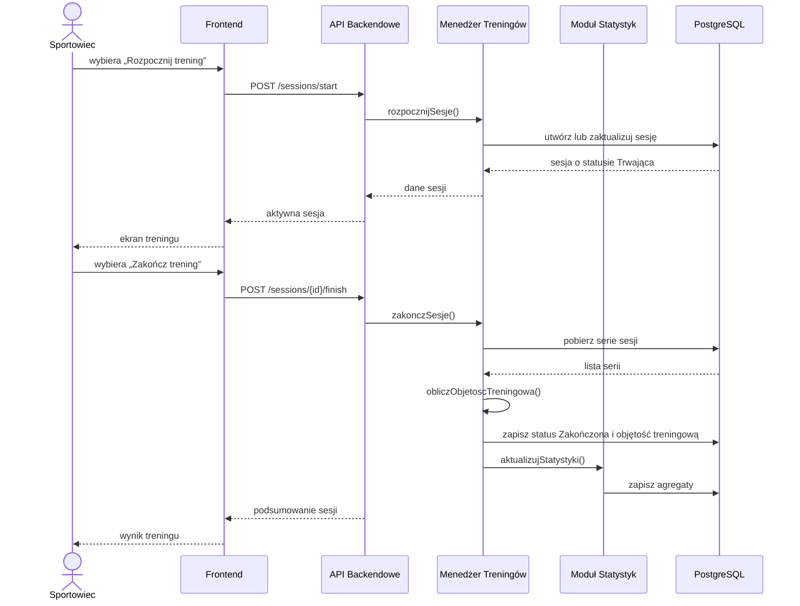
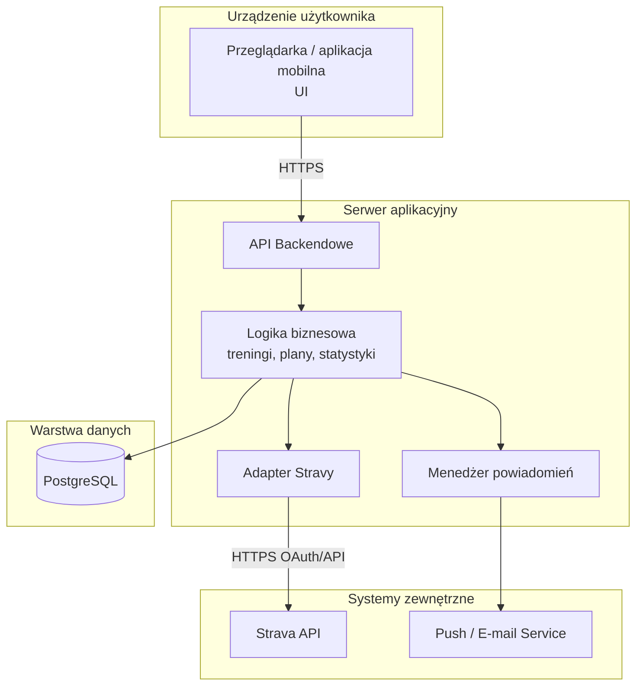

# Dziennik Treningów — kompletna specyfikacja systemu

**Projekt z przedmiotu:** Inżynieria oprogramowania  
**Autorzy:** Michał Kalinowski, Mateusz Kaliński  

---

## Spis treści

1. [Wprowadzenie, analiza rynku i motywacja](#1-wprowadzenie-analiza-rynku-i-motywacja)
   1.1. [Kontekst projektu i zrozumienie potrzeb klienta](#11-kontekst-projektu-i-zrozumienie-potrzeb-klienta)
   1.2. [Model opisowy systemu](#12-model-opisowy-systemu)
   1.3. [Analiza rynku i istniejących rozwiązań](#13-analiza-rynku-i-istniejących-rozwiązań)
   1.4. [Motywacja i główny przypadek użycia](#14-motywacja-i-główny-przypadek-użycia)
2. [Aktorzy systemu](#2-aktorzy-systemu)
3. [Model statyczny i zachowanie systemu](#3-model-statyczny-i-zachowanie-systemu)
   3.1. [Diagram kontekstu C4 — poziom 1](#31-diagram-kontekstu-c4--poziom-1)
   3.2. [Model statyczny: diagram klas i komponentów](#32-model-statyczny-diagram-klas-i-komponentów)
   3.3. [Diagram stanu sesji treningowej](#33-diagram-stanu-sesji-treningowej)
4. [Dynamika systemu i wymagania](#4-dynamika-systemu-i-wymagania)
   4.1. [Przypadki użycia](#41-przypadki-użycia)
   4.2. [Specyfikacja wymagań](#42-specyfikacja-wymagań)
   4.3. [Diagramy interakcji](#43-diagramy-interakcji)
5. [Projekt architektury i struktury](#5-projekt-architektury-i-struktury)
   5.1. [Model wdrożenia](#51-model-wdrożenia)
   5.2. [Proponowany model danych](#52-proponowany-model-danych)
6. [Testowanie oprogramowania](#6-testowanie-oprogramowania)
7. [Prototyp systemu](#7-prototyp-systemu)

---

# 1. Wprowadzenie, analiza rynku i motywacja

## 1.1. Kontekst projektu i zrozumienie potrzeb klienta

### 1.1.1. Temat projektu

Tematem projektu jest system **Dziennik Treningów** — aplikacja wspierająca rejestrowanie treningów siłowych, planowanie sesji, analizę progresu, współpracę sportowca z trenerem oraz opcjonalne uwzględnianie aktywności cardio pobieranych ze Strava API.

System ma być projektowany przede wszystkim jako narzędzie używane **w trakcie treningu**, a więc w warunkach, w których użytkownik nie chce wykonywać wielu operacji na ekranie telefonu. Z tego powodu centralną funkcjonalnością systemu jest szybki przepływ treningowy oraz mechanizm **Smart Auto-fill**, który podpowiada ciężar i liczbę powtórzeń na podstawie ostatniego wykonania tego samego ćwiczenia.

### 1.1.2. Cele aplikacji z punktu widzenia klienta

Z perspektywy klienta system ma realizować następujące cele:

| ID | Cel klienta | Uzasadnienie |
|---|---|---|
| C-01 | Minimalizacja czasu obsługi aplikacji podczas treningu | Użytkownik powinien koncentrować się na ćwiczeniu, a nie na ręcznym wpisywaniu danych. |
| C-02 | Rejestrowanie historii treningowej i progresu | System powinien przechowywać dane treningowe i pokazywać postęp w czasie. |
| C-03 | Automatyczne podpowiadanie parametrów serii | Smart Auto-fill ma ograniczać liczbę kliknięć i przepisywanie danych z poprzednich treningów. |
| C-04 | Czytelna motywacja użytkownika | System powinien oferować statystyki, odznaki, streaki i podsumowania typu Goryl-stats. |
| C-05 | Pełniejszy obraz obciążenia sportowca | System powinien umożliwiać połączenie treningu siłowego z cardio ze Stravy. |
| C-06 | Wsparcie współpracy trener–podopieczny | Trener powinien mieć możliwość przypisywania planów i komentowania treningów. |

---

## 1.2. Model opisowy systemu

### 1.2.1. Opis systemu w języku naturalnym

Dziennik Treningów jest aplikacją umożliwiającą użytkownikowi rejestrowanie sesji treningowych. Użytkownik może utworzyć konto, wybrać rolę sportowca lub trenera, zarządzać swoim profilem, przeglądać plany treningowe i rozpoczynać sesje treningowe. Sesja treningowa składa się z ćwiczeń, a każde ćwiczenie zawiera jedną lub wiele serii. Seria opisuje konkretne wykonanie ćwiczenia, czyli liczbę powtórzeń, ciężar, opcjonalne RPE i opcjonalny czas odpoczynku.

Podczas aktywnej sesji system podpowiada wartości dla nowej serii na podstawie historii ostatniego wykonania tego samego ćwiczenia. Mechanizm ten nazywa się Smart Auto-fill. Użytkownik może zatwierdzić zaproponowane wartości jednym kliknięciem albo edytować ciężar i liczbę powtórzeń, jeżeli wykonał serię inaczej niż poprzednio.

Po zakończeniu sesji system oblicza objętość treningową, aktualizuje historię treningową oraz przygotowuje dane do statystyk. Użytkownik może połączyć konto ze Stravą, aby system uwzględniał także aktywności cardio przy obliczaniu tygodniowego obciążenia. System może również prezentować podsumowania motywacyjne, streaki, odznaki i Goryl-stats.

Trener może zaprosić sportowca do relacji trener–podopieczny. Po akceptacji zaproszenia trener może tworzyć i przypisywać plany treningowe oraz zostawiać notatki przy sesjach. Trener nie może jednak modyfikować historycznych danych treningowych podopiecznego, ponieważ są one zapisem faktycznie wykonanego treningu.

### 1.2.2. Najważniejsze reguły biznesowe

| ID | Reguła biznesowa |
|---|---|
| BR-01 | Prawidłowo zapisana sesja treningowa musi zawierać co najmniej jedno ćwiczenie i jedną wykonaną serię. |
| BR-02 | Smart Auto-fill podpowiada dane, ale nie narzuca ich użytkownikowi. Użytkownik zawsze może edytować ciężar i powtórzenia. |
| BR-03 | Objętość treningowa jest obliczana jako suma iloczynów `ciężar × powtórzenia` dla wszystkich wykonanych serii. |
| BR-04 | Trener uzyskuje dostęp do danych podopiecznego dopiero po obustronnej akceptacji relacji. |
| BR-05 | Trener może komentować sesje podopiecznego, ale nie może modyfikować historycznych danych treningowych. |
| BR-06 | Integracja ze Stravą jest opcjonalna. Brak Stravy nie blokuje korzystania z głównego przepływu treningowego. |
| BR-07 | Dane treningowe użytkownika są domyślnie prywatne. |
| BR-08 | Streak jest liczony tygodniowo, a nie dziennie, aby nie zachęcać do przetrenowania. |

---

## 1.3. Analiza rynku i istniejących rozwiązań

### 1.3.1. Istniejące rozwiązania

Na rynku istnieją aplikacje wspierające rejestrowanie treningów siłowych, m.in. Strong, Hevy, FitNotes i JEFIT. Oferują one rozbudowane bazy ćwiczeń, historię treningów i wykresy progresu. Ich głównym problemem z perspektywy projektowanego systemu jest jednak duża liczba interakcji wymaganych podczas treningu.

| Rozwiązanie | Mocne strony | Ograniczenia istotne dla projektu |
|---|---|---|
| Strong | przejrzyste logowanie, historia, wykresy | wymaga ręcznego uzupełniania wielu danych |
| Hevy | funkcje społecznościowe, statystyki | duża liczba interakcji, nacisk na social |
| FitNotes | prostota, lokalność danych | ograniczona nowoczesność UX i automatyzacji |
| JEFIT | duża baza ćwiczeń i planów | rozbudowany interfejs, większy próg wejścia |

### 1.3.2. Wnioski z analizy konkurencji

1. Samo przechowywanie historii treningów nie jest wystarczającą przewagą konkurencyjną.
2. Główna wartość projektowanego systemu powinna wynikać z minimalizacji obsługi podczas treningu.
3. Smart Auto-fill powinien być traktowany jako centralny mechanizm systemu, a nie funkcja poboczna.
4. Integracja cardio powinna być opcjonalna, ponieważ nie każdy użytkownik korzysta ze Stravy.
5. Elementy społecznościowe i grywalizacja powinny być konfigurowalne, aby nie przeszkadzać użytkownikom trenującym indywidualnie.

---

## 1.4. Motywacja i główny przypadek użycia

### 1.4.1. Motywacja

Systematyczne zapisywanie treningów jest jednym z podstawowych warunków świadomego progresu. Użytkownik powinien wiedzieć, czy zwiększa ciężary, poprawia objętość treningową, utrzymuje regularność oraz czy jego tygodniowe obciążenie nie staje się zbyt wysokie. Papierowe dzienniki nie rozwiązują tego problemu kompleksowo, a istniejące aplikacje często wymagają zbyt wiele ręcznej obsługi.

Projektowany system odpowiada na tę lukę przez połączenie trzech wartości:

1. szybkiego logowania treningu,
2. automatycznych podpowiedzi z historii,
3. motywującej interpretacji danych.

### 1.4.2. Główny przypadek użycia na najwyższym poziomie abstrakcji

**UC-GŁÓWNY: Szybkie zarejestrowanie treningu siłowego**

Aktor główny: Sportowiec  
Cel: Zapisanie treningu przy minimalnej liczbie interakcji z ekranem.  
Rezultat: Sesja zostaje zapisana, serie są utrwalone, objętość treningowa jest obliczona, a historia treningowa zaktualizowana.

Ogólny przebieg:

1. Sportowiec otwiera aplikację i wybiera trening z planu albo rozpoczyna sesję ad hoc.
2. System pokazuje aktywną sesję i listę ćwiczeń.
3. Sportowiec wybiera ćwiczenie.
4. System pobiera ostatnie wykonanie tego ćwiczenia.
5. System podpowiada ciężar i liczbę powtórzeń.
6. Sportowiec zatwierdza serię jednym kliknięciem albo edytuje wartości.
7. System zapisuje serię.
8. Po wykonaniu treningu sportowiec kończy sesję.
9. System oblicza objętość treningową i aktualizuje statystyki.

---

# 2. Aktorzy systemu

Poniżsi aktorzy wyznaczają granice odpowiedzialności systemu i porządkują późniejsze przypadki użycia, wymagania oraz diagramy interakcji.

| Aktor | Typ | Opis | Przykładowe cele |
|---|---|---|---|
| Sportowiec | ludzki, główny | Użytkownik wykonujący i rejestrujący treningi. | rozpocząć sesję, dodać serię, sprawdzić progres |
| Trener | ludzki, pomocniczy | Użytkownik układający plany i komentujący treningi podopiecznych. | przypisać plan, przejrzeć historię, dodać notatkę |
| Administrator | ludzki, administracyjny | Zarządza konfiguracją systemu i reaguje na problemy techniczne. | zarządzać użytkownikami, monitorować działanie systemu |
| Strava API | system zewnętrzny | Dostarcza dane o aktywnościach cardio po autoryzacji. | zwrócić dane cardio do obciążenia tygodniowego |
| Serwis powiadomień | system zewnętrzny | Dostarcza techniczną możliwość wysłania push/e-mail. | wysłać przypomnienie lub komunikat |

---

# 3. Model statyczny i zachowanie systemu

## 3.1. Diagram kontekstu C4 — poziom 1

Poniższy diagram pokazuje system w jego otoczeniu biznesowym. Strava API i serwis powiadomień są systemami zewnętrznymi. Sportowiec i trener są aktorami ludzkimi.



**Rysunek 1. Diagram kontekstu C4 systemu Dziennik Treningów.**
Diagram pokazuje granicę systemu oraz najważniejsze podmioty, które z nim współpracują. Sportowiec i trener korzystają bezpośrednio z aplikacji, natomiast Strava API i serwis powiadomień są systemami zewnętrznymi wspierającymi funkcje dodatkowe.

---

## 3.2. Model statyczny: diagram klas i komponentów

### 3.2.1. Diagram klas



**Rysunek 2. Diagram klas głównych obiektów domenowych.**
Diagram przedstawia model obiektowy aplikacji: użytkowników, role sportowca i trenera, plany treningowe, sesje, serie oraz elementy wspierające, takie jak notatki, ankiety i odznaki. Pokazuje też, jak główny proces treningowy przekłada się na obiekty: plan zawiera sesje, sesja zawiera serie, a seria dotyczy konkretnego ćwiczenia.

### 3.2.2. Diagram komponentów



**Rysunek 3. Diagram komponentów systemu.**
Diagram opisuje logiczny podział aplikacji na frontend, API oraz moduły backendowe. Najważniejszym komponentem z perspektywy prototypu jest menedżer treningów, który obsługuje sesje, serie i Smart Auto-fill, a pozostałe moduły rozszerzają system o plany, statystyki, powiadomienia i integrację ze Stravą.

### 3.2.3. Interfejsy komponentów

| Komponent | Odpowiedzialność | Przykładowe interfejsy |
|---|---|---|
| Aplikacja kliencka | prezentacja danych i obsługa użytkownika | `GET /plans`, `POST /sessions`, `POST /sets` |
| API Gateway | wejście do backendu | autoryzacja żądań, routing do modułów |
| Moduł uwierzytelniania | logowanie, rejestracja, role | `POST /auth/login`, `POST /auth/register` |
| Menedżer treningów | sesje, ćwiczenia, serie, Smart Auto-fill | `POST /sessions`, `POST /sets`, `GET /exercises/{id}/last-set` |
| Moduł planów i trenera | plany, podopieczni, przypisania | `POST /plans`, `POST /coach/assign-plan` |
| Moduł statystyk | objętość treningowa, wykresy, streaki, odznaki | `GET /stats/progress`, `GET /stats/volume` |
| Adapter Stravy | izolacja integracji zewnętrznej | `GET /integrations/strava/sync` |
| Menedżer powiadomień | zlecanie powiadomień | `POST /notifications/send` |
| PostgreSQL | trwałe przechowywanie danych | tabele użytkowników, sesji, serii, ćwiczeń |

---

## 3.3. Diagram stanu sesji treningowej



**Rysunek 4. Diagram stanu sesji treningowej.**
Diagram pokazuje cykl życia pojedynczej sesji treningowej: od zaplanowania, przez rozpoczęcie i ewentualne wstrzymanie, aż do zakończenia, anulowania albo oznaczenia jako przegapionej. Ten model określa, kiedy sesja może być edytowana i kiedy może zostać uwzględniona w historii oraz statystykach.

### 3.3.1. Tabela przejść stanów

| Stan początkowy | Zdarzenie | Stan końcowy | Opis |
|---|---|---|---|
| Zaplanowana | `rozpocznij` | Trwająca | Użytkownik rozpoczyna zaplanowany trening. |
| Zaplanowana | `anuluj` | Anulowana | Użytkownik rezygnuje z treningu. |
| Zaplanowana | przekroczony termin | Przegapiona | Sesja nie została wykonana w planowanym czasie. |
| Trwająca | `wstrzymaj` | Wstrzymana | Użytkownik robi dłuższą przerwę. |
| Wstrzymana | `wznow` | Trwająca | Użytkownik wraca do treningu. |
| Trwająca | `zakoncz` | Zakończona | System zapisuje sesję i oblicza objętość treningową. |
| Trwająca/Wstrzymana | `anuluj` | Anulowana | Użytkownik przerywa sesję bez zapisu jako zakończonej. |

---

# 4. Dynamika systemu i wymagania

## 4.1. Przypadki użycia

### 4.1.1. Lista przypadków użycia

| ID | Nazwa | Aktor główny | Priorytet |
|---|---|---|---|
| UC-01 | Rozpoczęcie sesji treningowej | Sportowiec | wysoki |
| UC-02 | Dodanie ćwiczenia do sesji | Sportowiec | wysoki |
| UC-03 | Zatwierdzenie serii przez Smart Auto-fill | Sportowiec | wysoki |
| UC-04 | Edycja ciężaru i powtórzeń w aktywnej serii | Sportowiec | wysoki |
| UC-05 | Użycie poprzedniego ciężaru | Sportowiec | wysoki |
| UC-06 | Zakończenie sesji i obliczenie objętości treningowej | Sportowiec | wysoki |
| UC-07 | Utworzenie planu treningowego | Sportowiec / Trener | średni |
| UC-08 | Przypisanie planu podopiecznemu | Trener | średni |
| UC-09 | Dodanie notatki do sesji | Sportowiec / Trener | średni |
| UC-10 | Wypełnienie ankiety przed treningiem | Sportowiec | średni |
| UC-11 | Synchronizacja aktywności ze Stravy | Strava API / System | średni |
| UC-12 | Wyświetlenie statystyk postępu | Sportowiec | średni |
| UC-13 | Przyznanie odznaki | System | niski |
| UC-14 | Wysłanie powiadomienia o treningu | System czasu | niski |
| UC-15 | Dodanie znajomego | Sportowiec | niski |

### 4.1.2. UC-01 — Rozpoczęcie sesji treningowej

| Pole | Opis |
|---|---|
| Aktor główny | Sportowiec |
| Cel | Rozpoczęcie zaplanowanego albo spontanicznego treningu. |
| Warunki początkowe | Użytkownik jest zalogowany. |
| Warunki końcowe | Sesja otrzymuje status `Trwająca`. |
| Scenariusz główny | 1. Użytkownik otwiera dashboard. 2. Wybiera plan albo przycisk rozpoczęcia treningu ad hoc. 3. System tworzy lub otwiera sesję. 4. System ustawia status `Trwająca`. 5. System wyświetla ekran aktywnego treningu. |
| Scenariusze alternatywne | A1: Brak planu — użytkownik rozpoczyna sesję ad hoc. A2: Sesja już trwa — system otwiera aktywną sesję zamiast tworzyć nową. |
| Kryterium akceptacji | Użytkownik może przejść z dashboardu do aktywnej sesji i rozpocząć dodawanie ćwiczeń. |

### 4.1.3. UC-02 — Dodanie ćwiczenia do sesji

| Pole | Opis |
|---|---|
| Aktor główny | Sportowiec |
| Cel | Dodanie ćwiczenia do aktywnej sesji. |
| Warunki początkowe | Sesja ma status `Trwająca`. |
| Warunki końcowe | Ćwiczenie jest widoczne na ekranie sesji. |
| Scenariusz główny | 1. Użytkownik wybiera `Dodaj ćwiczenie`. 2. System pokazuje bibliotekę ćwiczeń. 3. Użytkownik wybiera ćwiczenie. 4. System dodaje ćwiczenie do sesji. 5. System próbuje pobrać ostatnie dane do Smart Auto-fill. |
| Scenariusze alternatywne | A1: Ćwiczenia nie ma w bibliotece — użytkownik tworzy własne ćwiczenie. A2: Brak historii — system nie pokazuje podpowiedzi. |
| Kryterium akceptacji | Ćwiczenie pojawia się w aktywnej sesji i użytkownik może dodać serię. |

### 4.1.4. UC-03 — Zatwierdzenie serii przez Smart Auto-fill

| Pole | Opis |
|---|---|
| Aktor główny | Sportowiec |
| Cel | Zapisanie serii na podstawie podpowiedzi systemu. |
| Warunki początkowe | Sesja trwa, ćwiczenie jest dodane, istnieje historia tego ćwiczenia. |
| Warunki końcowe | Seria jest zapisana jako wykonana. |
| Scenariusz główny | 1. System pobiera ostatnią wykonaną serię danego ćwiczenia. 2. System pokazuje ciężar i powtórzenia jako podpowiedź. 3. Użytkownik klika `Zrobione`. 4. System zapisuje serię. 5. System pokazuje następną serię do wykonania. |
| Scenariusze alternatywne | A1: Użytkownik zmienia ciężar. A2: Użytkownik zmienia liczbę powtórzeń. A3: Użytkownik usuwa serię przed zapisem. |
| Kryterium akceptacji | Przy istniejącej podpowiedzi użytkownik może zapisać serię maksymalnie w dwóch akcjach. |

### 4.1.5. UC-04 — Edycja ciężaru i powtórzeń w aktywnej serii

| Pole | Opis |
|---|---|
| Aktor główny | Sportowiec |
| Cel | Dostosowanie podpowiedzianych wartości do faktycznie wykonanej serii. |
| Warunki początkowe | Na ekranie znajduje się aktywna seria z polami ciężaru i powtórzeń. |
| Warunki końcowe | Zapisana seria zawiera wartości wybrane przez użytkownika. |
| Scenariusz główny | 1. System pokazuje pola ciężaru i powtórzeń. 2. Użytkownik edytuje jedną lub obie wartości. 3. Użytkownik zatwierdza serię. 4. System zapisuje zmienione wartości. |
| Scenariusze alternatywne | A1: Użytkownik przywraca poprzedni ciężar przyciskiem `Poprzedni ciężar`. A2: Użytkownik anuluje edycję. |
| Kryterium akceptacji | Użytkownik może zmienić ciężar i powtórzenia bez opuszczania ekranu aktywnego treningu. |

### 4.1.6. UC-05 — Użycie poprzedniego ciężaru

| Pole | Opis |
|---|---|
| Aktor główny | Sportowiec |
| Cel | Szybkie przywrócenie ciężaru z poprzedniego wykonania ćwiczenia. |
| Warunki początkowe | Istnieje historia ćwiczenia, a użytkownik edytuje serię. |
| Warunki końcowe | Pole ciężaru zostaje ustawione na wartość z poprzedniej sesji. |
| Scenariusz główny | 1. Użytkownik klika przycisk `Poprzedni ciężar`. 2. System pobiera ostatni ciężar dla ćwiczenia. 3. System wstawia wartość do aktywnej serii. |
| Kryterium akceptacji | Przycisk działa bez ręcznego wpisywania wartości przez użytkownika. |

### 4.1.7. UC-06 — Zakończenie sesji i obliczenie objętości treningowej

| Pole | Opis |
|---|---|
| Aktor główny | Sportowiec |
| Cel | Zapisanie sesji jako zakończonej i obliczenie jej podsumowania. |
| Warunki początkowe | Sesja trwa i zawiera co najmniej jedno ćwiczenie oraz jedną wykonaną serię. |
| Warunki końcowe | Sesja ma status `Zakończona`, a objętość treningowa i statystyki są zaktualizowane. |
| Scenariusz główny | 1. Użytkownik wybiera `Zakończ trening`. 2. System sprawdza minimalną poprawność sesji. 3. System oblicza objętość treningową. 4. System zapisuje sesję. 5. System aktualizuje statystyki. 6. System wraca do widoku podsumowania. |
| Scenariusze alternatywne | A1: Sesja nie ma serii — system informuje, że nie można jej zakończyć jako poprawnej. A2: Użytkownik anuluje zakończenie. |
| Kryterium akceptacji | Po zakończeniu sesji użytkownik widzi podsumowanie z wykonanymi ćwiczeniami i objętością treningową. |

---

## 4.2. Specyfikacja wymagań

### 4.2.1. Wymagania funkcjonalne

| ID | Wymaganie | Priorytet | Kryterium akceptacji |
|---|---|---|---|
| FR-01 | System umożliwia rejestrację i logowanie użytkownika. | wysoki | Użytkownik może utworzyć konto i zalogować się. |
| FR-02 | Użytkownik może edytować podstawowe dane profilu. | średni | Zmiany profilu są zapisywane i widoczne po odświeżeniu. |
| FR-03 | Użytkownik może rozpocząć sesję z planu albo ad hoc. | wysoki | Sesja przechodzi do stanu `Trwająca`. |
| FR-04 | Użytkownik może dodać ćwiczenie do aktywnej sesji. | wysoki | Ćwiczenie pojawia się w ekranie sesji. |
| FR-05 | Użytkownik może dodać serię z ciężarem i liczbą powtórzeń. | wysoki | Seria zostaje zapisana w ramach ćwiczenia. |
| FR-06 | System podpowiada dane serii na podstawie ostatniego wykonania ćwiczenia. | wysoki | Po dodaniu ćwiczenia system pokazuje poprzedni ciężar i powtórzenia, jeżeli istnieją. |
| FR-07 | Użytkownik może zatwierdzić podpowiedzianą serię jednym kliknięciem. | wysoki | Seria zostaje zapisana po kliknięciu `Zrobione`. |
| FR-08 | Użytkownik może edytować ciężar i powtórzenia na żywo podczas sesji. | wysoki | Zmienione wartości zostają zapisane bez opuszczania ekranu treningu. |
| FR-09 | System udostępnia przycisk ustawienia poprzedniego ciężaru. | wysoki | Kliknięcie przywraca ostatni ciężar danego ćwiczenia. |
| FR-10 | System umożliwia zakończenie sesji treningowej. | wysoki | Sesja otrzymuje status `Zakończona`. |
| FR-11 | System oblicza objętość treningową sesji. | wysoki | Objętość treningowa jest równa sumie ciężar × powtórzenia dla wykonanych serii. |
| FR-12 | System umożliwia tworzenie planów treningowych. | średni | Plan można zapisać i ponownie otworzyć. |
| FR-13 | System umożliwia korzystanie z biblioteki ćwiczeń. | wysoki | Użytkownik może wyszukiwać i wybierać ćwiczenia. |
| FR-14 | System pozwala dodać własne ćwiczenie. | średni | Nowe ćwiczenie jest dostępne w bibliotece użytkownika. |
| FR-15 | System umożliwia dodanie notatki do sesji. | średni | Notatka jest widoczna przy danej sesji. |
| FR-16 | System może wyświetlać statystyki postępu. | średni | Użytkownik widzi historię ciężaru lub objętości treningowej w czasie. |
| FR-17 | System może obsługiwać ankietę przed treningiem. | niski | Użytkownik może ocenić sen i samopoczucie w skali 1–5. |
| FR-18 | System może sugerować intensywność treningu. | niski | System zwraca sugestię: lekki, normalny albo ciężki trening. |
| FR-19 | System może integrować się ze Strava API. | niski | Po autoryzacji system pobiera dane cardio. |
| FR-20 | Trener może przypisać plan podopiecznemu. | niski | Podopieczny widzi plan po akceptacji relacji. |
| FR-21 | Trener może dodać notatkę przy sesji podopiecznego. | niski | Notatka jest widoczna dla podopiecznego. |
| FR-22 | System może wysyłać powiadomienia. | niski | Użytkownik otrzymuje przypomnienie push lub e-mail. |
| FR-23 | Użytkownik może eksportować dane do CSV lub JSON. | średni | Plik eksportu zawiera historię treningów. |

### 4.2.2. Wymagania niefunkcjonalne

| ID | Kategoria | Wymaganie | Kryterium weryfikacji |
|---|---|---|---|
| NFR-01 | Wydajność | Standardowe operacje API nie powinny przekraczać 2 sekund. | Pomiar czasu odpowiedzi dla dodania serii i załadowania sesji. |
| NFR-02 | Wydajność | Statystyki agregowane mogą ładować się do 5 sekund. | Test obciążeniowy na danych historycznych. |
| NFR-03 | Użyteczność | Dodanie serii z podpowiedzią nie może wymagać więcej niż 2 kliknięcia. | Test UX głównego przepływu treningowego. |
| NFR-04 | Offline | Rejestrowanie serii musi działać bez połączenia z internetem. | Test w trybie offline z późniejszą synchronizacją. |
| NFR-05 | Bezpieczeństwo | Dane treningowe są domyślnie prywatne. | Test uprawnień dla innych użytkowników. |
| NFR-06 | Bezpieczeństwo | Dostęp trenera wymaga jawnej akceptacji podopiecznego. | Test relacji trener–podopieczny. |
| NFR-07 | Bezpieczeństwo | Hasła nie mogą być przechowywane jawnie. | Przegląd bazy i kodu uwierzytelniania. |
| NFR-08 | Bezpieczeństwo | Komunikacja odbywa się przez HTTPS. | Weryfikacja konfiguracji środowiska. |
| NFR-09 | Skalowalność | System powinien mieć architekturę modułową. | Przegląd diagramu komponentów i zależności. |
| NFR-10 | Eksport | Użytkownik może wyeksportować swoje dane. | Test eksportu CSV/JSON. |
| NFR-11 | Dostępność interfejsu | UI powinien być czytelny na telefonie i przy obsłudze jedną ręką. | Test manualny na urządzeniu mobilnym. |

---


## 4.3. Diagramy interakcji

### 4.3.1. Diagram sekwencji — Smart Auto-fill i zapis serii



**Rysunek 5. Diagram sekwencji Smart Auto-fill i zapisu serii.**
Diagram opisuje fragment aktywnego treningu, w którym sportowiec wybiera ćwiczenie, a system pobiera ostatnie zapisane wartości dla tego ćwiczenia. Następnie użytkownik zatwierdza lub edytuje podpowiedź, a backend zapisuje serię w bazie danych.

### 4.3.2. Diagram sekwencji — rozpoczęcie i zakończenie sesji



**Rysunek 6. Diagram sekwencji rozpoczęcia i zakończenia sesji.**
Diagram przedstawia główny przepływ biznesowy aplikacji: utworzenie aktywnej sesji, wykonanie treningu i zapisanie zakończonej sesji. Pokazuje też moment obliczenia objętości treningowej oraz aktualizacji statystyk po zakończeniu treningu.


---

# 5. Projekt architektury i struktury

## 5.1. Model wdrożenia

### 5.1.1. Architektura fizyczna

System jest projektowany jako aplikacja wielowarstwowa. Warstwa interfejsu użytkownika działa na urządzeniu użytkownika. Warstwa logiki biznesowej działa na serwerze aplikacyjnym. Warstwa danych jest realizowana przez bazę PostgreSQL oraz opcjonalnie Redis jako pamięć podręczną.



**Rysunek 7. Diagram wdrożenia systemu.**
Diagram pokazuje fizyczny podział systemu na urządzenie użytkownika, serwer aplikacyjny, warstwę danych i systemy zewnętrzne. Frontend komunikuje się z backendem przez HTTPS, backend zapisuje dane w PostgreSQL oraz opcjonalnie komunikuje się ze Stravą i serwisem powiadomień.

### 5.1.2. Struktura trójwarstwowa

| Warstwa | Odpowiednik w projekcie | Odpowiedzialność |
|---|---|---|
| Warstwa interfejsu użytkownika | aplikacja web/mobile | prezentacja dashboardu, planów, sesji, serii i statystyk |
| Warstwa reguł biznesowych | API backendowe i moduły domenowe | obsługa sesji, Smart Auto-fill, planów, statystyk, uprawnień |
| Warstwa danych | PostgreSQL | trwałe przechowywanie danych i cache często używanych informacji |

### 5.1.3. Konfiguracja technologiczna

Poniższy stack jest referencyjną konfiguracją technologiczną systemu. Jeżeli implementacja używa innych narzędzi, należy podmienić nazwy technologii bez zmiany architektury logicznej.

| Obszar | Technologia | Uzasadnienie |
|---|---|---|
| Frontend | React + TypeScript | szybkie tworzenie interfejsu web/mobile-first |
| Backend | Python + FastAPI | sprawna implementacja REST API i logiki biznesowej |
| Baza danych | PostgreSQL | relacyjny model danych i spójność transakcyjna |
| ORM | SQLAlchemy | mapowanie obiektowo-relacyjne |
| Cache | opcjonalny cache statystyk i odznak | przyspieszenie odczytów danych agregowanych |
| Komunikacja | REST/JSON przez HTTPS | prosty i czytelny kontrakt frontend–backend |
| Uwierzytelnianie | JWT / sesje serwerowe | kontrola dostępu do API |
| Integracja Stravy | OAuth 2.0 + Adapter | bezpieczne połączenie z zewnętrznym API |
| Testy | Jest/Vitest, Playwright/Cypress | testy jednostkowe, integracyjne i E2E |

---


## 5.2. Proponowany model danych

| Encja | Najważniejsze pola | Relacje |
|---|---|---|
| `users` | `id`, `email`, `password_hash`, `name`, `weight`, `height` | ma wiele planów, sesji, odznak |
| `roles` | `id`, `user_id`, `role` | przypisane do użytkownika |
| `training_plans` | `id`, `owner_id`, `name`, `goal`, `start_date`, `end_date` | zawiera sesje planowane |
| `training_sessions` | `id`, `user_id`, `plan_id`, `status`, `planned_at`, `performed_at`, `training_volume` | zawiera serie i notatki |
| `exercises` | `id`, `name`, `muscle_group`, `type`, `technique_url` | używane przez serie |
| `sets` | `id`, `session_id`, `exercise_id`, `set_number`, `weight_kg`, `reps`, `rpe`, `completed` | należy do sesji i ćwiczenia |
| `notes` | `id`, `session_id`, `author_id`, `content`, `author_type` | należy do sesji |
| `pre_workout_surveys` | `id`, `session_id`, `sleep_quality`, `wellbeing`, `suggested_intensity` | należy do sesji |
| `coach_athlete_relations` | `id`, `coach_id`, `athlete_id`, `status` | łączy trenera i sportowca |
| `badges` | `id`, `name`, `description`, `condition` | definicje odznak |
| `user_badges` | `id`, `user_id`, `badge_id`, `earned_at` | zdobyte odznaki |
| `strava_activities` | `id`, `user_id`, `external_id`, `type`, `distance`, `duration`, `load` | dane cardio |

---


# 6. Testowanie oprogramowania

## 6.1. Strategia testowania

Testowanie systemu powinno obejmować weryfikację, czyli sprawdzenie zgodności z wymaganiami, oraz walidację, czyli sprawdzenie, czy system faktycznie rozwiązuje problem użytkownika. W przypadku tego projektu najważniejsza jest walidacja głównego przepływu treningowego: użytkownik powinien móc zapisać serię szybko, bez rozproszenia i bez zbędnych ekranów.

## 6.2. Typy testów

| Typ testu | Zakres w projekcie |
|---|---|
| Testy jednostkowe | obliczanie objętości treningowej, wybór ostatniej serii, walidacja danych serii |
| Testy integracyjne | zapis serii przez API do bazy, synchronizacja statystyk, relacja trener–podopieczny |
| Testy systemowe | pełny przepływ od dashboardu do zakończenia sesji |
| Testy funkcjonalne Black Box | sprawdzenie wymagań bez znajomości kodu |
| Testy strukturalne White Box | analiza logiki Smart Auto-fill i walidacji uprawnień |
| Testy statyczne | przegląd kodu, linting, analiza typów |
| Testy bezpieczeństwa | dostęp do danych, autoryzacja trenera, ochrona tokenów |
| Testy użyteczności | liczba kliknięć, czytelność UI, obsługa jedną ręką |

## 6.3. Przypadki testowe

| ID | Nazwa testu | Typ | Warunki | Kroki | Oczekiwany rezultat |
|---|---|---|---|---|---|
| TC-01 | Rozpoczęcie sesji | systemowy | użytkownik zalogowany | kliknij `Rozpocznij trening` | sesja ma status `Trwająca` |
| TC-02 | Dodanie ćwiczenia | funkcjonalny | aktywna sesja | wybierz ćwiczenie z biblioteki | ćwiczenie pojawia się w sesji |
| TC-03 | Smart Auto-fill | funkcjonalny | istnieje historia ćwiczenia | dodaj ćwiczenie do sesji | system pokazuje ostatni ciężar i powtórzenia |
| TC-04 | Użycie poprzedniego ciężaru | funkcjonalny | istnieje poprzedni ciężar | kliknij `Poprzedni ciężar` | pole ciężaru zostaje uzupełnione |
| TC-05 | Edycja serii | funkcjonalny | aktywna seria | zmień ciężar i powtórzenia | seria zapisuje nowe wartości |
| TC-06 | Maksymalnie 2 kliknięcia | użyteczności | Smart Auto-fill aktywny | zatwierdź serię | zapis wymaga maksymalnie 2 akcji |
| TC-07 | Zakończenie sesji | systemowy | sesja ma serię | kliknij `Zakończ trening` | sesja ma status `Zakończona` |
| TC-08 | Obliczanie objętości treningowej | jednostkowy | serie: 100×5, 80×10 | oblicz objętość treningową | wynik: 1300 kg |
| TC-09 | Brak serii przy zakończeniu | funkcjonalny | sesja bez serii | kliknij `Zakończ trening` | system pokazuje błąd walidacji |
| TC-10 | Statystyki progresu | integracyjny | zakończona sesja | otwórz statystyki | dane obejmują zakończoną sesję |
| TC-OFF-01 | Zapis offline | systemowy | brak internetu | dodaj serię | seria zapisuje się lokalnie i synchronizuje po powrocie internetu |

---

# 7. Prototyp systemu

## 7.1. Cel prototypu

Celem prototypu jest pokazanie głównego procesu biznesowego aplikacji, czyli szybkiego wykonania i zapisania treningu siłowego. Prototyp nie stanowi osobnej architektury systemu i nie zmienia docelowego zakresu opisanego w poprzednich rozdziałach. Jest demonstracją najważniejszego przepływu użytkownika, który pozwala zweryfikować, czy aplikacja rzeczywiście ogranicza liczbę interakcji z ekranem podczas treningu.

Najważniejsza decyzja dotycząca prototypu brzmi: **prototyp powinien skupić się na jakości głównego przepływu treningowego, a nie na implementacji wszystkich funkcji pobocznych**. Dzięki temu projekt pozostaje zgodny z pierwotną motywacją: aplikacja ma być szybkim, wygodnym i praktycznym dodatkiem do treningu, a nie kolejnym narzędziem wymagającym długiej obsługi podczas ćwiczeń.

## 7.2. Zakres prototypu

W prototypie należy skupić się na przepływie, który najlepiej pokazuje wartość systemu:

```text
Dashboard → Plany treningowe → Plan → Sesja treningowa → Ćwiczenia → Serie → Smart Auto-fill → Edycja wartości → Zakończenie treningu
```

| Funkcja | Status w prototypie | Uzasadnienie |
|---|---|---|
| Dashboard | uwzględnione | punkt startowy aplikacji |
| Lista planów treningowych | uwzględnione | użytkownik widzi swoje plany |
| Widok planu | uwzględnione | plan zawiera sesje treningowe |
| Widok sesji treningowej | uwzględnione | główny ekran pracy użytkownika |
| Ćwiczenia w sesji | uwzględnione | sesja składa się z ćwiczeń |
| Serie w ćwiczeniu | uwzględnione | podstawowy zapis treningu |
| Edycja ciężaru i powtórzeń na żywo | uwzględnione | konieczne dla zgodności z założeniami UX |
| Przycisk `Poprzedni ciężar` | uwzględnione | wspiera Smart Auto-fill |
| Przycisk `Zrobione` | uwzględnione | szybkie zatwierdzenie serii |
| Zakończenie treningu | uwzględnione | zamknięcie procesu biznesowego |
| Strava | nieuwzględnione w prototypie | integracja zewnętrzna nie jest konieczna do pokazania głównego przepływu treningowego |
| Panel trenera | nieuwzględnione w prototypie | moduł nie blokuje demonstracji samodzielnego treningu sportowca |
| Feed społecznościowy | nieuwzględnione w prototypie | funkcja poboczna wobec zapisu treningu |
| Odznaki i Goryl-stats | nieuwzględnione w prototypie | funkcja motywacyjna, możliwa do dodania po ustabilizowaniu przepływu treningowego |

